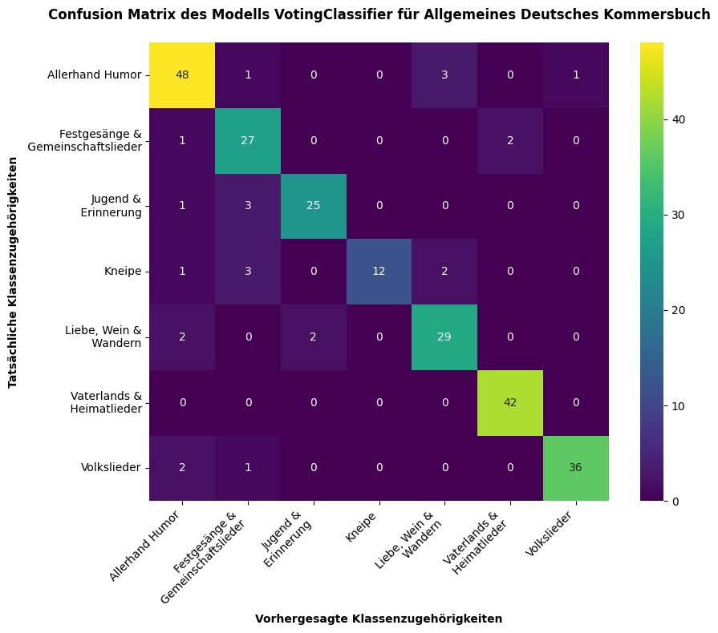
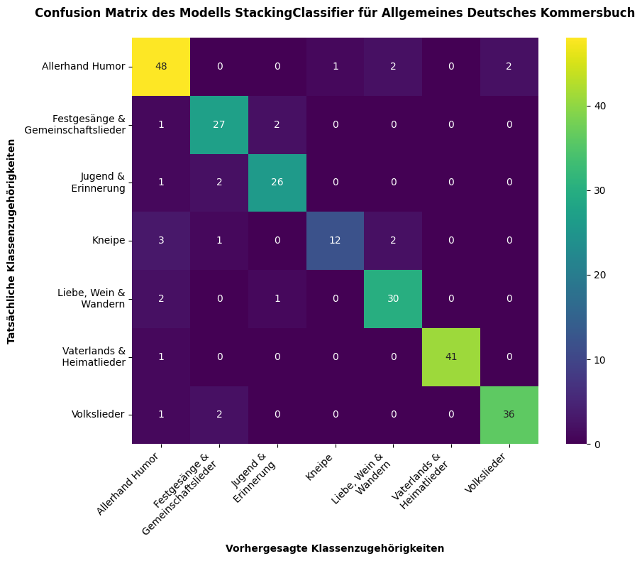
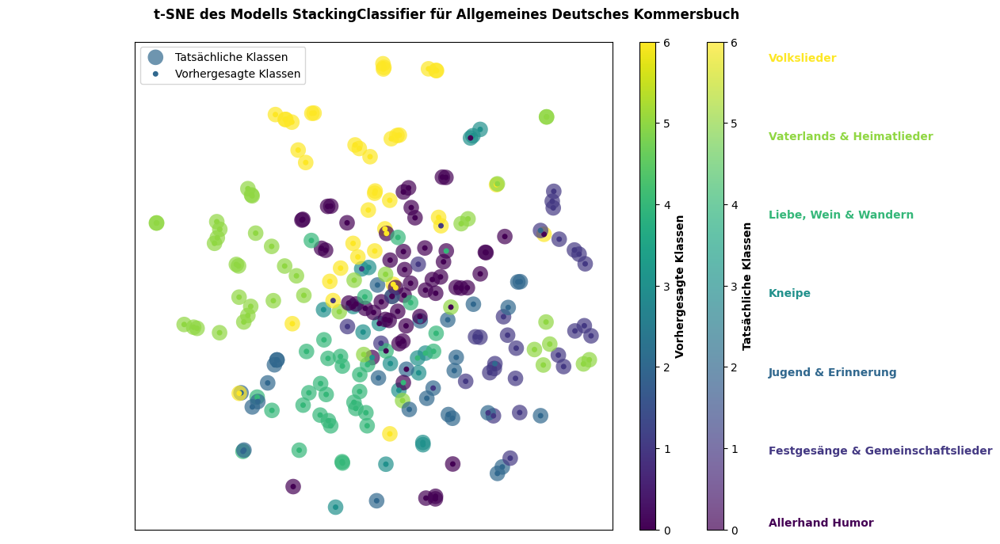
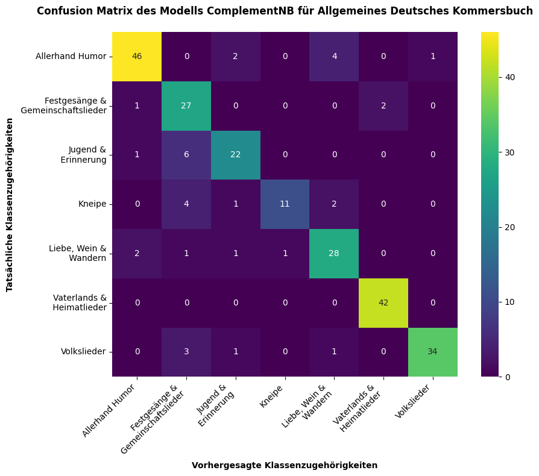

# Klassifizierung der Lieder aus dem Allgemeinen Deutschen Kommersbuch (auch Lahrer Kommersbuch genannt) nach ihren Kategorien

Seit mehreren Jahrhunderten werden auf Veranstaltungen von Studierendenverbindungen, wie Kneipen (interne Feiern) oder Festkommersen (offizielle Feierlichkeiten), Lieder aus dem Allgemeinen Deutschen Kommersbuch gesungen. Dieses Liederbuch, das Mitte des 19. Jahrhunderts erstmals erschien und seitdem in zahlreichen Auflagen überarbeitet wurde, enthält eine Sammlung von Liedern, die für verbindungs- bzw. cooleurstudentische Anlässe traditionell von Bedeutung sind. Durch die vielen Überarbeitungen hat sich das Kommersbuch zu einem der am häufigsten aufgelegten Liederbücher dieser Art entwickelt. Die darin enthaltenen Lieder sind (mit leichten Abweichungen je nach Auflage) in unterschiedliche, historisch und kulturell begründete Kategorien eingeteilt. Diese Einteilung durch die Herausgebenden wirft die Frage auf, welche spezifischen Merkmale und Gemeinsamkeiten die Lieder innerhalb der Kategorien aufweisen, die eine klare Kategorisierung ermöglichen.

Das Ziel dieses Projekts war es, diese Merkmale durch eine automatisierte Feature-Extraktion zu identifizieren – sowohl innerhalb der einzelnen Kategorien als auch kategorieübergreifend. Basierend auf diesen extrahierten Merkmalen wurde eine Klassifizierung der Lieder vorgenommen und evaluiert. Die Inhalte des Allgemeinen Deutschen Kommersbuches sowie die Kategorisierungen der Lieder wurden mittels Webscraping aus der digitalisierten und transkribierten Auflage 55-58 von Wikisource entnommen, die unter der Lizenz CC-BY-SA 2.0 zur Verfügung steht: https://de.wikisource.org/wiki/Allgemeines_Deutsches_Kommersbuch
Die Feature-Extraktion und Klassifizierung erfolgten mithilfe der Python-Bibliotheken scikit-learn, pandas, numpy, spaCy, gensim, stanza, cltk und nltk. Zur Optimierung wurden verschiedene Features und Klassifikatoren sowie deren Kombinationen getestet; zur Evaluation der Modelle kam eine 5-fache Kreuzvalidierung zum Einsatz. Das beste Ergebnis erzielte ein Voting Classifier auf der Grundlage eines Ensemble-Modells der Naive-Bayes-Klassifikatoren von sechs verschiedenen Features, das eine Genauigkeit von 0,87 ± 0,03 und einen F1-Score von 0,87 ± 0,03 erreichte. Des Weiteren hat sich Stacking Classifier auf der Basis der Kombination aus den SVM-Klassifikatoren für TF-IDF und BoW mit der Genauigkeit von 0.86 ± 0.03 und dem F1-Maß von 0.86 ± 0.03 etabliert, sowie Naive Bayes ausschließlich für BoW mit der Genauigkeit beträgt 0.85 ± 0.04 und dem F1-Maß 0.84 ± 0.04.

Kategorien und Anzahl der Lieder pro Kategorie kann man der Tabelle entnehmen:

| Kategorie                        | Anzahl der Lieder pro Kategorie |
|----------------------------------|---------------------------------|
| Vaterlands & Heimatlieder        | 135                             |
| Festgesänge & Gemeinschaftslieder | 95                              |
| Jugend & Erinnerung              | 92                              |
| Liebe, Wein & Wandern            | 109                             |
| Volkslieder                      | 126                             |
| Kneipe                           | 67                              |
| Allerhand Humor                  | 187                             |

Die Ergebnisse der oben genannten Klassifikatoren kann man genauer auf folgenden Visualisierungen betrachten:

Hinweise auf Fehler und mögliche Verbesserungsvorschläge, sowie Anfragen zur Kollaboration nehme ich mit Dankbarkeit auf!

Zum Zitieren: Arazyan, Nune: Klassifizierung der Lieder aus dem Allgemeinen Deutschen Kommersbuch (auch Lahrer Kommersbuch genannt) nach ihren Kategorien, Online: 01.11.2024, https://github.com/nunearazyan/klassification-allgemeines-deutsches-kommersbuch

## Inhalt

- Projektbeschreibng
- Lizenz (CC-BY-SA) s. hier: https://creativecommons.org/licenses/by-sa/4.0/deed.de
- "Liedertexte_Webscraping_Arazyan.py"
Python-Script zum Webscraping der Lieder aus dem Allgemeinen Deutschen Kommersbuch von Wikisource
- "kommersbuch_output.txt"
Nach dem Webscraping bereinigte und mit Kategorien versehenen Lieder
- "Kommersbuch_Features_Arazyan.py"
Python-Script zur Feature-Extraction. Es wurden auf der Basis von Originaltexten, bereinigten sowie lemmatisierten Texten folgende Features extrahiert: Interpunktion (Punkte, Kommata, einfache, doppelte und dreifache Ausrufezeichen, Fragezeichen, Semikolons, Doppelpunkte, Anführungszeichen, Klammern, Gedankenstriche, Auslassungspunkte sowie Wiederholungsanweisungen und das Vorkommen dieser Zeichen pro Lied), POS-Tags und ihr Vorkommen pro Lied, Abhängigkeitsverhältnisse im Satz und ihr Vorkommen pro Lied, NER, fünf durch Latent Dirichlet Allocation (LDA) ermittelte Themen und ihre Gewichtung pro Lied, Features NRC Word-Emotion Association Lexicon und ihre Gewichtung pro Lied, Bag-of-Words der Top-50 Wörter, basierend auf der Kategorie, TF-IDF der Top-50 Wörter, basierend auf der Kategorie, Informationsgewinn der Top-50 Wörter pro Kategorie als Hilfsfeature
- "German-NRC-EmoLex.txt"
Datei mit der automatisierten Übersetzungen für die Wörter aus dem Lexikon aus folgender Quelle: S. Rehurek, Radim; Sojka, Petr: Gensim–python framework for vector space modelling. NLP Centre, Faculty of Informatics, Masaryk University, Brno, Czech Republic 2011, 3(2). Näheres zum LDA-Modell s. https://radimrehurek.com/gensim/models/ldamodel.html (Letzter Zugriff: 29.10.2024).
- "df_kommersbuch.csv"
DataFrame mit Kategorien, Titeln, Originaltexten, bereinigten Texten, lemmatisierten Texten, Interpunktion-Features, POS, NER, LDA, EmoLex
- "bow_kommersbuch.csv"
DataFrame mit Kategorien, Titeln und den Frequenzen zu den Top-50 Wörtern in BoW pro Kategorie
- "tfidf_kommersbuch.csv"
DataFrame mit Kategorien, Titeln und TF-IDF der Top-50 Wörtern pro Kategorie
- "ig_kommersbuch.csv"
DataFrame mit Kategorien, Wörtern und deren IG
- Visualisierungen: Confusion Matrix und t-SNE
"voting_cm_plot.png", "voting_tsne_plot.png", "stacking_cm_plot.png", "stacking_tsne_plot.png", "nbbow_cm_plot.png" und "nbbow_tsne_plot.png"

## Primärquellen

- Silcher, Friedrich; Erk, Friedrich (Hg.): Allgemeines Deutsches Kommersbuch. Lahr 1896. 
Digitalisiert und transkribiert auf Wikisource. Die Materialien, sowie ihre Richtlinien und Versionsgeschichte ist unter folgendem Link verfügbar: https://de.wikisource.org/wiki/Allgemeines_Deutsches_Kommersbuch 

## Forschungsliteratur zum Allgemeinen Deutschen Kommersbuch und studentischen Liedern. Kleine Auswahl

- Dürbeck, Wolfram: Vom Vagantenlied zum Kneipgesang. Das deutsche Studentenlied im Wandel der Zeiten, in: Einst und Jetzt. Jahrbuch 2002 des Vereins für corpsstudentische Geschichtsforschung, Band 47, Neustadt a. d. Aisch 2002
- Fick, Richard (Hg.): Auf Deutschlands hohen Schulen: eine illustrierte kulturgeschichtliche Darstellung deutschen Hochschul- und Studentenwesens, Berlin; Leipzig 1990, Fotomechanischer Nachdruck 1997 für die Studentenhistorische Bibliothek, Band 5
- Gärdtner, Petra: “Liebchen, nicht um Goldes Lohne…” Frauen im Liedgut der Korporierten, Lang, Raimund (Hg.): Ergo Cantemus. Texte und Materialien zum Studentenlied, Köln, 2001
- Grütter, Werner: Probleme bei der Neuauflage des Lahrer Kommersbuches, in: Lang, Raimund (Hg.): Ergo Cantemus. Texte und Materialien zum Studentenlied, Köln 2001
- Kindleben, Christian Wilhelm: Studentenlieder. Aus den hinterlassenen Papieren eines unglücklichen Philosophen Florido genannt, gesammlet und verbessert von C. W. K. Halle 1781
Lang, Raimund: Der studentische Gesang, in: Lang, Raimund (Hg.): Ergo Cantemus. Texte und Materialien zum Studentenlied, Köln 2001
- Niemann, August Christian Heinrich: Akademisches Liederbuch. Erstes Bändchen. Dessau und Leipzig 1782
Objartel, Georg: Sprache und Lebensform deutscher Studenten im 18. und 19. Jahrhundert: Aufsätze und Dokumente. Berlin, Boston 2016

## Forschungsliteratur zur Klassifizierung von literarischen und musikalischen Gattungen

- Bellmann, Franz; Bunzel, Lea; Demus, Christoph; Fellendorf, Lisa; Gräupner, Olivia; Hu, Qiuyi; Lange, Tamara; Stuhr, Alica; Xi, Jian; Labudde, Dirk; Spranger, Michael: Multi-Label Classification of Blurbs with SVM Classifier Chains, in:  Conference on Natural Language Processing, Online: 2019, https://corpora.linguistik.uni-erlangen.de/data/konvens/proceedings/papers/germeval/Germeval_Task1_paper_1.pdf (Letzter Zugriff: 29.10.2024).
- Dwiyani, Luh Kade; Suarjaya, I Made Agus Dwi; Rusjayanthi, Ni Kadek Dwi: Classification of Explicit Songs Based on Lyrics Using Random Forest Algorithm, in: Journal of Information Systems and Informatics, 5 (2), Palembang 2023, S. 550 ff.
- Girase, Aarti; Advirkar, Apurva; Patil, Chandrika; Khadpe, Dhanshri; Pokhare, Amruta: Lyrics Based Song Genre Classification, in: Journal of Computing Technologies, 3 (2), 2014, S. 16ff.
- Gupta, Shikha; Agarwal, Mohit; Jain, Satbir: Automated Genre Classification of Books Using Machine Learning and Natural Language Processing, in: 2019 9th International Conference on Cloud Computing, Data Science & Engineering (Confluence), Noida 2019, S. 269ff. 
- Guthrie, Ben; Henstrom, Jordan; Horrocks, Ben; West, Ryan: Determining Genre of Classical Literature with Machine Learning, Online: 2019, https://raw.githubusercontent.com/ryanwest6/book-genre-classifier/master/doc/ResearchProject.pdf (Letzter Zugriff: 29.10.2024).
- Hettinger, Lena; Becker, Martin; Reger, Isabella; Jannidis, Fotis; Hotho, Andreas: Genre Classification on German Novels, Online: 2015, https://webis.de/events/tir-15/tir15-papers-final/Hettinger2015-tir-paper.pdf (Letzter Zugriff: 29.10.2024).
- Hettinger, Lena; Jannidis, Fotis; Reger, Isabella; Hotho, Andreas: Significance Testing for the Classification of Literary Subgenres, in: Digital Humanities 2016 Book of Abstracts. Krakow, Online: 2016, https://dh-abstracts.library.virginia.edu/works/2630 (Letzter Zugriff: 29.10.2024).
- Kim, Evgeny; Padó, Sebastian; Klinger, Roman: Investigating the Relationship between Literary Genres and Emotional Plot Development, in: Proceedings of the Joint SIGHUM Workshop on Computational Linguistics for Cultural Heritage, Social Sciences, Humanities and Literature, Vancouver 2017, S. 17ff.
- Kim, Hyung Jin; Chung, Minjong; Lee, Wonhong: Literary Style Classification with Deep Linguistic Analysis Features, Online: 2011, https://nlp.stanford.edu/courses/cs224n/2011/reports/mjipeo-evion-wonhong.pdf (Letzter Zugriff: 29.10.2024).
- Liu, Sicong; Huang, Zihan; Li, Yikang; Sun, Zhanlin; Wu, Jiahao; Zhang, Hongyi: DeepGenre: Deep neural networks for genre classification in literary works, Online: 2020, https://scott-liu.com/assets/pdfs/deepgenre.pdf (Letzter Zugriff: 29.10.2024).
- Monte Serrat, Dionéia; Machado, Mateus; Ruiz, Evandro: A machine learning approach to literary genre classification on Portuguese texts: circumventing NLP’s standard varieties, Online: 2021, https://sol.sbc.org.br/index.php/stil/article/view/17805 (Letzter Zugriff: 29.10.2024).
- Pizarro Martinez, Servando; Zimmermann, Moritz; Offermann, Miguel Serkan; Reither, Florian: Exploring Genre and Success Classification through Song Lyrics using DistilBERT: A Fun NLP Venture, Online: 2024, https://arxiv.org/abs/2407.21068 (Letzter Zugriff: 29.10.2024).
- Sadovsky, Adam; Chen, Xingming: Song Genre and Artist Classification via Supervised Learning from Lyrics, Online: 2006, https://nlp.stanford.edu/courses/cs224n/2006/fp/sadovsky-x1n9-1-224n_final_report.pdf (Letzter Zugriff: 29.10.2024).
- Shiroya, Parilkumar; Vaghasiya, Darshan; Soni, Meet; Panchal, Brijeshkumar: Book Genre Categorization Using Machine Learning Algorithms (K-Nearest Neighbor, Support Vector Machine and Logistic Regression) using Customized Dataset, in: International Journal of Computer Science and Mobile Computing, 10 (3), Stockholm 2021, S. 14ff.
- Vanetik, Natalia; Tiamanova, Margarita; Kogan, Genady; Litvak, Marina: Genre Classification of Books in Russian with Stylometric Features: A Case Study, in: Information, 15 (6), Basel 2024, S. 340ff.
- Worsham, Joseph; Kalita, Jugal: Genre Identification and the Compositional Effect of Genre in Literature, in: Proceedings of the 27th International Conference on Computational Linguistics, Santa Fe 2018, S.1963ff.
- Yao, Tengjun; Zhai, Zhengang: Text Classification Model Based on fastText, in: 2020 IEEE International Conference on Artificial Intelligence and Information Systems (ICAIIS), Dalian 2020, S. 154ff.

## Technische Dokumentationen

- Diaz, Gene: stopwords-iso. Online: 05.03.2020, https://github.com/stopwords-iso/stopwords-iso/blob/master/stopwords-iso.json (Letzter Zugriff: 29.10.2024).
- Harris, Charles R. et al.: Array programming with NumPy, in: Nature 585, 2020, S. 357ff.
- Honnibal, Matthew; Montani, Ines: spaCy. Online: 2016, https://spacy.io/api/doc (Letzter Zugriff: 28.10.2024).
- Hunter, John D.: Matplotlib: A 2D Graphics Environment, in: Computing in Science & Engineering, 9 (3), 2007, S 90ff.
- Johnson, Kyle P.; Burns, Patrick; Stewart, John; Cook, Todd: The Classical Language Toolkit. Online: 2014, https://github.com/cltk/cltk (Letzter Zugriff: 28.10.2024).
- Mohammad, Saif; Turney, Peter: Crowdsourcing a Word-Emotion Association Lexicon, in: Computational Intelligence, 29 (3), 2013, S. 436-465 oder Mohammad, Saif; Turney, Peter: Emotions Evoked by Common Words and Phrases: Using Mechanical Turk to Create an Emotion Lexicon, in: Proceedings of the NAACL-HLT 2010 - Workshop on Computational Approaches to Analysis and Generation of Emotion in Text, LA 2010. Die Lexika können hier heruntergeladen werden: https://saifmohammad.com/WebPages/NRC-Emotion-Lexicon.htm (Letzter Zugriff: 29.10.2024).
- Pedregosa, Fabian et al.: Scikit-learn: Machine Learning in Python, in: JMLR 12, 2011, S. 2825-2830. Näheres s. hier: https://scikit-learn.org/stable/index.html (Letzter Zugriff: 29.10.2024).
- Qi, Peng; Zhang, Yuhao; Zhang, Yuhui; Bolton, Jason; Manning, Christopher D.: Stanza: A Python Natural Language Processing Toolkit for Many Human Languages, in: Association for Computational Linguistics (ACL) System Demonstrations, 2020.
- Rehurek, Radim; Sojka, Petr: Gensim–python framework for vector space modelling. NLP Centre, Faculty of Informatics, Masaryk University, Brno, Czech Republic 2011, 3(2). Näheres zum LDA-Modell s. https://radimrehurek.com/gensim/models/ldamodel.html (Letzter Zugriff: 29.10.2024).
- Richardson, Leonard: beautifulsoup4 4.12.3. Online: 17.01.2024., https://pypi.org/project/beautifulsoup4/ (Letzter Zugriff: 28.10.2024).
- The pandas development team: pandas, Online: 02.2020, https://doi.org/10.5281/zenodo.3509134 (Letzter Zugriff: 28.10.2024).
- Waskom, Michael L.: seaborn: statistical data visualization, in: Journal of Open Source Software, 6 (60), S. 3021.